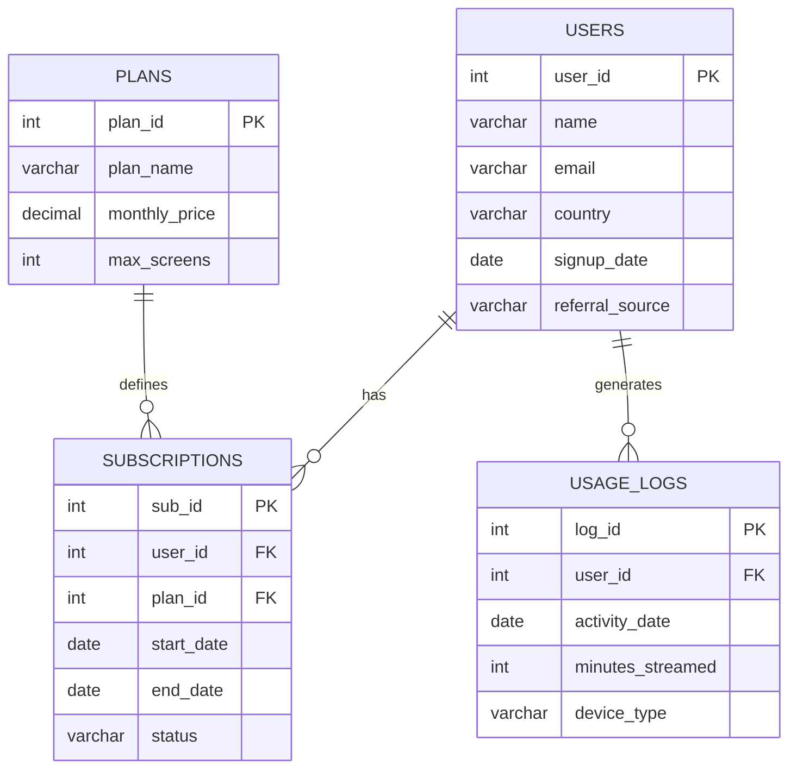

# MetricStream — Database Management System

A relational database management system for a subscription-based streaming platform. The project models users, subscription plans, subscription lifecycles, and streaming activity while supporting analytical SQL queries for business insights such as Monthly Recurring Revenue (MRR), churn analysis, and device usage statistics.

---

# Project Structure

```
MetricStream/
│── schema.sql              # Database schema (CREATE TABLE statements)
│── data_import.sql         # Sample data insertion script
│── analytics_queries.sql   # Analytical SQL queries
└── README.md               # Project documentation
```

---

# Project Explanation

MetricStream is designed to simulate the backend database of a streaming platform.

The system stores:

- User account information
- Subscription plans
- Customer subscription history
- Streaming activity logs

Using these interconnected tables, the database can answer important business questions such as:

- Monthly Recurring Revenue (MRR)
- Active subscriber count
- Subscription churn
- Device usage statistics
- Country-wise user distribution
- User engagement analysis

The database follows normalization principles to minimize redundancy while maintaining efficient relationships between entities.

---

# Features

- User profile management
- Subscription plan management
- Subscription lifecycle tracking
- Streaming activity logging
- Business analytics through SQL
- Normalized relational schema
- Primary and Foreign Key constraints

---

# Entity Relationship Diagram

The database contains four primary entities connected through one-to-many relationships.

- **Users → Subscriptions (1:N)**  
  A user can have multiple subscription records over time.

- **Plans → Subscriptions (1:N)**  
  A single subscription plan can be used by many subscribers.

- **Users → Usage Logs (1:N)**  
  A user can generate multiple streaming sessions.



---

# Database Schema

## 1. Users

Stores customer account information.

| Column | Data Type | Description |
|---------|-----------|-------------|
| user_id | INT | Primary Key |
| name | VARCHAR(100) | Customer name |
| email | VARCHAR(100) | Unique email address |
| country | VARCHAR(50) | Country of residence |
| signup_date | DATE | Registration date |
| referral_source | VARCHAR(50) | Marketing acquisition source |

---

## 2. Plans

Stores subscription plan information.

| Column | Data Type | Description |
|---------|-----------|-------------|
| plan_id | INT | Primary Key |
| plan_name | VARCHAR(50) | Plan name |
| monthly_price | DECIMAL | Monthly subscription fee |
| max_screens | INT | Maximum simultaneous screens |

---

## 3. Subscriptions

Tracks user subscription history.

| Column | Data Type | Description |
|---------|-----------|-------------|
| sub_id | INT | Primary Key |
| user_id | INT | Foreign Key → Users |
| plan_id | INT | Foreign Key → Plans |
| start_date | DATE | Subscription start date |
| end_date | DATE | Subscription end date |
| status | VARCHAR(20) | Active / Cancelled / Expired |

---

## 4. Usage_Logs

Stores streaming session information.

| Column | Data Type | Description |
|---------|-----------|-------------|
| log_id | INT | Primary Key |
| user_id | INT | Foreign Key → Users |
| activity_date | DATE | Streaming date |
| minutes_streamed | INT | Total minutes streamed |
| device_type | VARCHAR(50) | Mobile, Laptop, Smart TV, Web, etc. |

---

# Database Relationships

| Parent Table | Child Table | Relationship |
|--------------|-------------|--------------|
| Users | Subscriptions | One-to-Many |
| Plans | Subscriptions | One-to-Many |
| Users | Usage_Logs | One-to-Many |

---

# Technologies Used

- PostgreSQL
- SQL
- pgAdmin 4 / DBeaver
- Mermaid ER Diagram

---

# How to Run the Project

## Step 1: Create the Database

```sql
CREATE DATABASE metricstream;
```

Connect to the newly created database.

---

## Step 2: Create Tables

Run:

```
schema.sql
```

This creates all required tables and relationships.

---

## Step 3: Insert Sample Data

Run:

```
data_import.sql
```

This populates the database with sample records.

---

## Step 4: Execute Analytical Queries

Run:

```
analytics_queries.sql
```

Each query demonstrates a different business insight.

---

# Sample SQL Queries

## 1. Device-wise Streaming Sessions

```sql
SELECT device_type,
       COUNT(log_id) AS total_sessions
FROM Usage_Logs
GROUP BY device_type;
```

---

## 2. Active Subscribers

```sql
SELECT COUNT(*)
FROM Subscriptions
WHERE status='Active';
```

---

## 3. Monthly Recurring Revenue (MRR)

```sql
SELECT SUM(p.monthly_price) AS monthly_revenue
FROM Subscriptions s
JOIN Plans p
ON s.plan_id = p.plan_id
WHERE s.status='Active';
```

---

## 4. Country-wise Users

```sql
SELECT country,
       COUNT(*) AS users
FROM Users
GROUP BY country;
```

---

## 5. Total Streaming Time per User

```sql
SELECT u.name,
       SUM(l.minutes_streamed) AS total_minutes
FROM Users u
JOIN Usage_Logs l
ON u.user_id = l.user_id
GROUP BY u.name;
```

---

# Expected Output Example

### Device Usage

| Device | Sessions |
|---------|----------|
| Mobile | 18 |
| Laptop | 10 |
| Smart TV | 7 |
| Web | 5 |

---

### Active Subscribers

| Active Users |
|--------------|
| 12 |

---

### Monthly Revenue

| Revenue |
|----------|
| 369.88 |

---

# Future Improvements

- Payment history table
- Watch history table
- Content catalog
- Genres and categories
- Multiple user profiles
- Recommendation engine support
- Stored procedures and triggers
- Views for analytics dashboards

---

# Learning Outcomes

This project demonstrates:

- Relational database design
- Database normalization
- Primary and Foreign Keys
- One-to-Many relationships
- SQL joins
- Aggregate functions
- GROUP BY
- Business analytics queries
- Database documentation

---

# Author

**Zeel Pansuriya**

Database Management System Project
